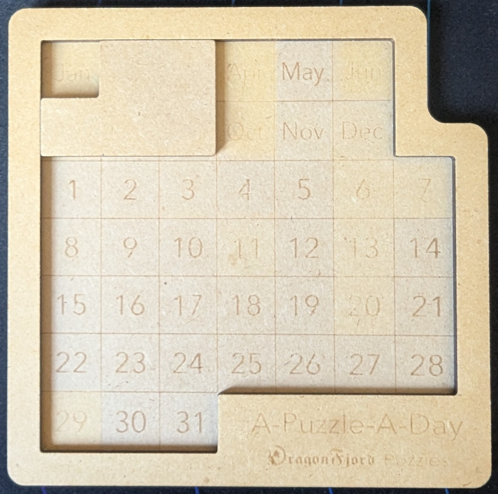
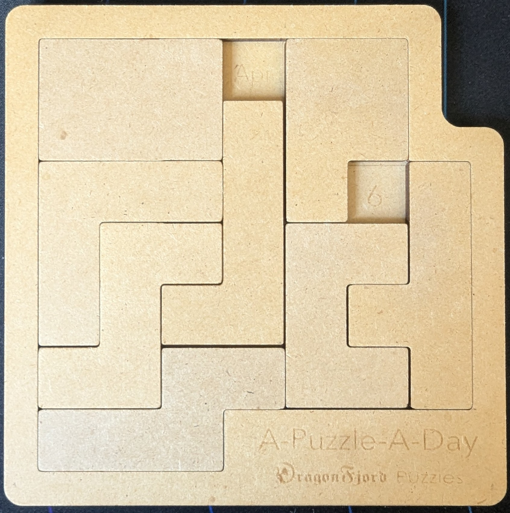
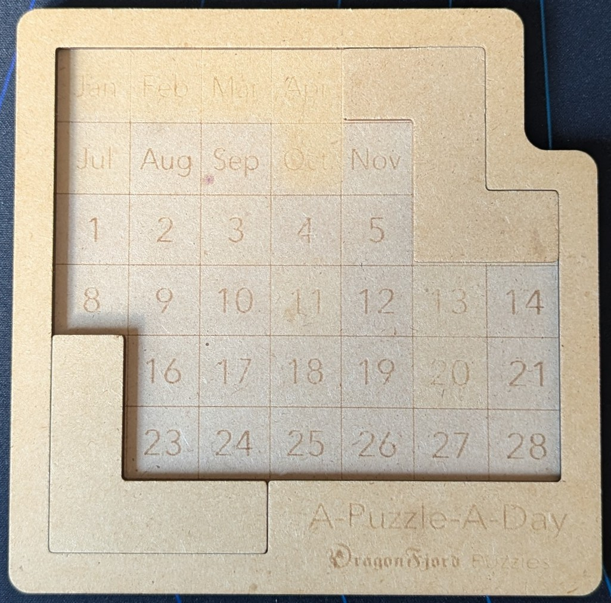
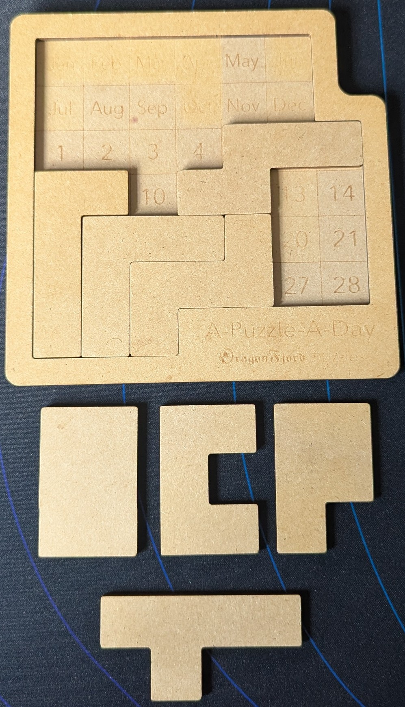
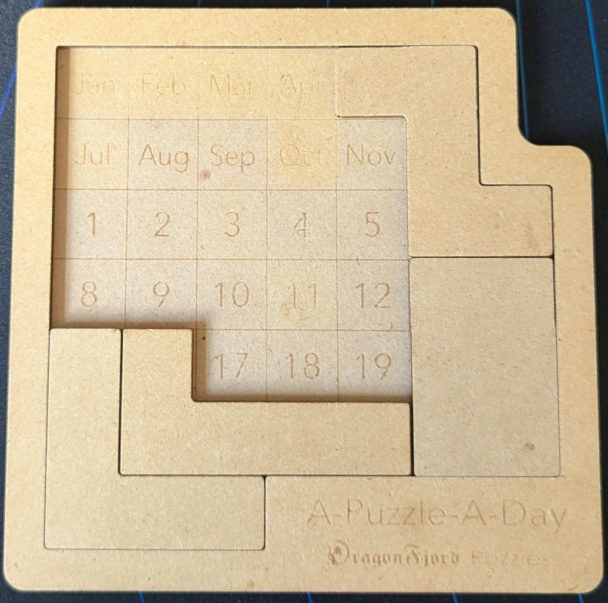
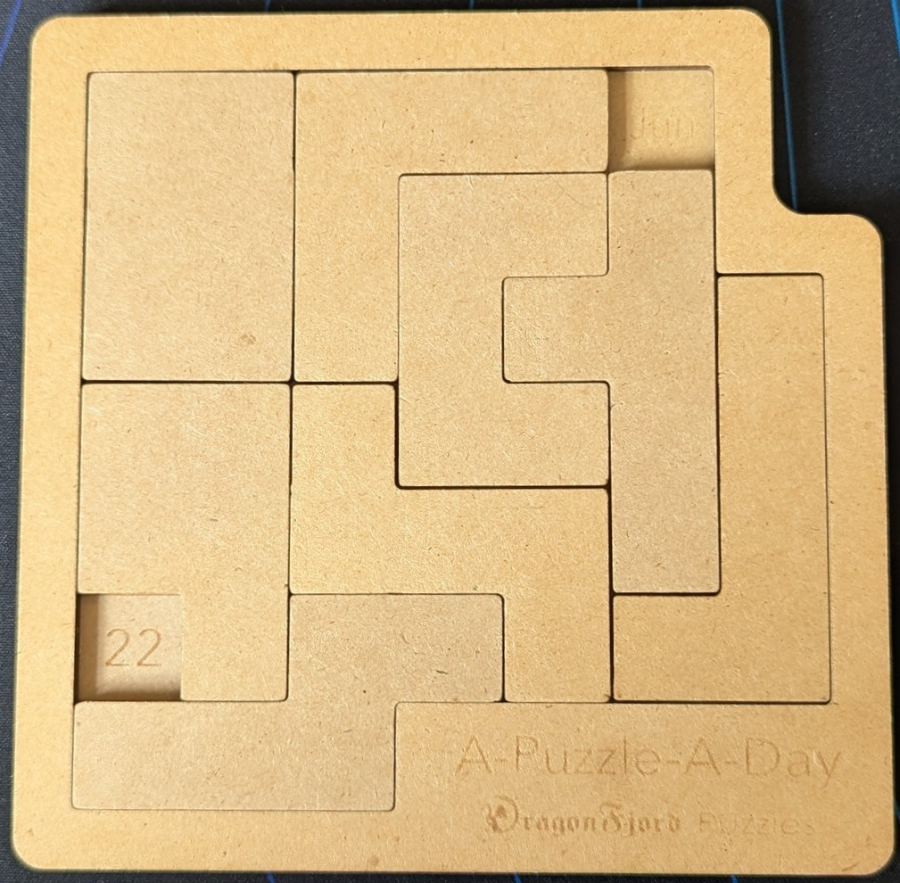

:pad: Puzzle-A-Day
:pad-link: https://www.dragonfjord.com/product/a-puzzle-a-day/[Puzzle-a-Day]

{pad}
=====

{pad-link} is a calendar puzzle with solutions for every day of the year. Consisting of 8 pieces of different shapes and a grid of cells with the months and days printed on it. The pieces are able to cover all but two of the cells on the board. The pieces can be arranged in ways such that every day + month combination is visible. I encountered this puzzle a couple of years ago and bought one, which has lived on my table for large chunks of that time, and provided entertainment over many breakfasts.

Over playing with this puzzle I came up with various questions I couldn't answer by hand, so I decided to write some tools to find the answers. The final thing which inspired this was when I stumbled upon an arrangement that could produce every day from Jan 10th to Jan 31st while leaving four pieces untouched - with four pieces fixed, the other four could be rearranged to leave any cell uncovered. I wondered if this particular arrangement was the only (probably not), and if there are arrangements that could do more _dates_ while keeping several pieces fixed?

{pad-link} is a https://en.wikipedia.org/wiki/Pentomino[pentomino]-based puzzle, with a single hexomino. Pentominoes have been around centuries and studied by far more capable mathematicians than me. This will not be a deep-dive into the mathematics behind pentominoes, but a small look specifically at {pad} to answer a few questions I have.
{pad} has been around for more than five years so https://keiichiw.github.io/a-puzzle-a-day-solver/[various] https://www.hglbrg.com/lab/puzzle[solvers] https://www.puzzleadaysolver.com/solver[exist], as do generic solvers for polyomino puzzles, but I decided to write my own for fun and practice.

= Questions

*Question 1* - Having solved the puzzle many times by hand I had some intuitions about the most common/effective piece placements and wanted to check them. I also wanted see if there are any I have missed. Which are the placements that appear most often in the solution set?

*Question 2* - The question which inspired this was that of which fixed subsets of pieces give the most dates? How does the four-piece arrangement I discovered compare?

*Question 3* - What is the smallest number of changes required to complete an entire year?

*Question 4* - I've seen some https://www.reddit.com/r/puzzles/comments/t9uejy/analysis_of_a_puzzle_a_day/[other analysis] that covers the puzzle and address some questions like which day has the fewest solutions (06 October - 7 solutions), the most solutions (25 January - 216 solutions), the same for months (January is easiest - average 103 solutions per day, September is hardest - average 44 solutions per day). However, there is another aspect to difficulty I wanted to look at: Which days have the lowest average placement ranking in all of its solutions?

= Approach

The board and pieces are represented as `numpy` arrays.

== Board

The board is represented as a 9x9 `numpy` array, with `0`s for the cells that need to be covered, and `1`s for cells that are not available for placing a piece. The board is padded on all four sizes with an extra border of `1`s to simplify the code used to check for unfilled gaps. It's initial state is seen below. A solved board has a `1` in every cell.

[source,python]
np.array([[1, 1, 1, 1, 1, 1, 1, 1, 1],
          [1, 0, 0, 0, 0, 0, 0, 1, 1],
          [1, 0, 0, 0, 0, 0, 0, 1, 1],
          [1, 0, 0, 0, 0, 0, 0, 0, 1],
          [1, 0, 0, 0, 0, 0, 0, 0, 1],
          [1, 0, 0, 0, 0, 0, 0, 0, 1],
          [1, 0, 0, 0, 0, 0, 0, 0, 1],
          [1, 0, 0, 0, 1, 1, 1, 1, 1],
          [1, 1, 1, 1, 1, 1, 1, 1, 1]], dtype=np.int8)

== Piece

Pieces are also `numpy` arrays, of varying sizes, with `1`s for each cell they cover, and `0` for gaps. An example is below.

[source,python]
np.array([[1, 1],  # Piece P
          [1, 1],
          [1, 0]])

Each piece is assigned a letter as follows (shown in their base orientation):

[source]
O: ◼◼
   ◼◼
   ◼◼

[source]
P: ◼◼
   ◼◼
   ◼◻

[source]
C: ◼◼
   ◼◻
   ◼◼

[source]
L: ◼◻◻
   ◼◻◻
   ◼◼◼

[source]
Z: ◼◼◻
   ◻◼◻
   ◻◼◼

[source]
J: ◻◼
   ◻◼
   ◻◼
   ◼◼

[source]
T: ◼◼◼◼
   ◻◼◻◻

[source]
X: ◻◼
   ◼◼
   ◼◻
   ◼◻

== Dataset: Piece Placements

In order to store the board state for each solution I defined a simple text notation that described the position and orientation of each piece.

* Columns and Rows are one-indexed, counted from the top left, column (x coordinate) first.
* Each piece is given a letter, chosen to be whatever letter the piece most resembles, and a base orientation.
* Rotations are always 90° clockwise
* If a piece is flipped it is done so from its starting orientation (before rotations) and is flipped around the vertical axis i.e. the `p` piece is flipped to look like a `q` (still referred to as `P`)

 {column}{row}{piece}{rotations}{flipped:optional}

*Note* that the coordinate is the cell _covered_ by the top-left-most part of the piece. In some cases (e.g. piece `J`) the piece can protrude left from the given coordinate.

Example `21P1f` is piece `P`, flipped vertically, rotated clockwise 90°, with its origin at column 2, row 1 (in the top left leaving `Jan` visible).

.Example piece placement of piece P, rotated and flipped, in cell 2,1

A full solution for a date is given as a csv string, where the first item is the date and the rest are the piece placements, e.g. `06apr,11O1,51P0,42J0,13L1,73T1f,24Z0f,54C0,36X1f`

.Example full solution for 6th April

== Optimisations

Given the need to generate the solution set once it's not critical that the solver is highly optimised, but the obvious optimisation is detect an unsolvable board early by finding unfillable gaps. Once a board has an unfillable gap it can safely be discarded as a possible solution. I define an unfillable hole as an area of one, two, three, or four cells that are uncovered but completely surrounded.

I initially built a solver for a single date, then parallelised that to solve for all dates. This takes four minutes to generate the entire solution set, more than fast enough for a problem of this scale to be run once, but not the most efficient implementation. If a solution was needed that would solve repeatedly then a far faster implementation would use Knuth's Algorithm X with Dancing Links.

= Answers

== Question 1 - Which individual placements are most common?

The full top 10 is as follows:

[cols="1,1"]
|===
|Piece Placement |Number of Solutions

|`51Z0`
|5418

|`15L0`
|4461

|`16O1`
|3523

|`74L3`
|2457

|`64O0`
|1996

|`36X1f`
|1923

|`73J0`
|1915

|`11O0`
|1829

|`11C0`
|1712

|`73T1f`
|1632
|===

Perhaps predictably it turns out these are all placements on the perimeter of the board, where the shape of the piece mates cleanly with a section of the edge. It was gratifying to find that the two most common moves among all solutions are the two I expected: `51Z0` and `15L0`.

.Two of the most common placements, 51Z0 and 15L0

=== Unique Dates
The above is merely counting solutions, but what if we cound the number of different dates the placement appears in?

[cols="1,1"]
|===
|Piece Placement |Number of Unique Dates

|15L0
|311

|16O1
|295

|73J0
|292

|36X1f
|286

|74L3
|281

|73T1
|279

|35L3
|276

|16P3
|274

|75J3f
|268

|63J2f
|257
|===

`15L0` appears at the top, but I was surprised to find the top placement among all solutions, `51Z0` completely drops off the top 10! Otherwise it's not surprising to again find piece placements which put pieces around the edge of the board.

`15L0` can solve so many days I decided to look for days that it cannot solve. Since placing the L-piece in the bottom-left-hand corner covers day numbers 15, 22, 29, 30, and 31 it cannot solve any of those, but of the rest I discovered the _only_ day in the rest of the year that cannot be solved with the `15L0` piece placement is 06 April.

== Question 2 - Which combinations of placements are in the most solutions?

Each combination of 2, 3, 4, 5 and 6 pieces is present in the most solutions, but here we will focus on the four-piece arrangements since from some initial analysis, that's the most fixed pieces where there are different numbers of dates for the arrangements. All the most versatile arrangements of five pieces can give 32 dates, and with six pieces all the best give 16.

Here's the 10 most versatile four-piece arrangements:

[cols="1,1"]
|===
|Four-Piece Placement |Number of Unique Dates

|`55Z1`, `25L1`, `14J2`, `53X3f`
|56

|`64O0`, `15L0`, `25J1`, `51Z0`
|56

|`53L1`, `44Z1`, `36X3f`, `14J2`
|56

|`55J3f`, `64O0`, `15L0`, `51Z0`
|53

|`63Z0f`, `53X0`, `14J2`, `74L3`
|53

|`74L3`, `64Z1`, `14J2`, `53X3f`
|53

|`36X1f`, `24Z0f`, `73J0`, `13L1`
|44

|`16O1`, `52X2f`, `51Z0`, `74L3`
|43

|`36X1f`, `24Z0f`, `35T0f`, `13L1`
|42

|`43T3`, `52X2f`, `51Z0`, `74L3`
|42
|===

.Most versatile piece arrangement 55Z1, 25L1, 14J2, 53X3f, with 56 dates possible

Every one of these has three of four key pieces: `L`, `Z`, `X` and `J`. This makes total sense since the three pieces based on a 3x2 shape (`C`, `O` and `P`) are all interchangeable with one another. Between `C` and `P`, any cell can be left exposed, resulting on so many different dates from the same start.

My arrangement - `21X1`, `51Z0`, `12L1`, `23J1f` - while pleasing, only give 22 solutions and doesn't come close to the best at 56 dates. My solution is hampered by the fact it covers all the months, meaning each uncovered day can only be used once. The most versatile four-piece solutions leave multiple months and days available so each day can be used in more than once continuation. I was at least on the right track with the pieces used though!

.The arrangement I stumbled on with 22 dates possible

== Question 3 - What is the smallest number of changes required to complete an entire year?

In order to answer this question a graph of all solutions was built. Each solution is a node, and each node has edges connecting it to every solution for the following date. The weight of the edge is the number of differences from each date to the next. Then https://en.wikipedia.org/wiki/Dijkstra's_algorithm[Dijkstra's Algorithm] is used to find the shortest path from January 1st to December 31st.

Due to the structure of the graph - 365 (or 366) linear steps with many possible (and equal/similar weighted) ways to take each step - there is relatively little performance benefit using Dijkstra as opposed to a naive exhaustive approach.

The smallest number of changes that can give every date for a full year is 1155 (and 1159 for a leap year). See the CSV files in `analysis/` for the full solutions.

There are likely more possible options that also can give a full year in the same number of changes due to there being so many edges and edge weight being limited to a such small range.

== Question 4 - Which is the rarest solution?

Here I'm chosing to define "rarest" as the lowest average frequency, across the whole solution set, of each piece placement in a solution.

The single rarest solution is for the 31st January (21T0f, 61X0, 12O1, 43J3f, 63P0, 15L1, 45Z1, 55C3) where the placements appear in an average of 245 other solutions across the whole solution set.

Rarity can also be consisdered by day, not by solution. Considering the rarest day, where the most common solution for that day is the rarest of all days. That is 22nd June, with its most common solution being `11O0`, `31L1`, `42C0`, `62T1`, `73J0`, `14P0f`, `34Z1f`, `36X1f`, having an average frequency of 148.5.

.Solution for 22nd June

All the days with the msot unusual solutions have the following in common: both the month and the day is on the edge of the board. This makes sense taken with the discovery from Question 1 that all the most common piece placements are on the edge of the board. Having gaps on the edges of the board restricts that and seems to force the puzzle down unusual paths.

The top and bottom rows seem to have the biggest impact, the months January and June and the dates 22nd, 28th, 29th, 30th and 31st, because they require leaving gaps in the corners. They also mostly exclude the single most versatile piece placement, `15L0`.

The 7th of January just squeaks into the top to unusual days, at 10th, again with gaps required to be in corners.

= Conclusions

Some takeaways from this little investigation:

* If possible for the date, start with the 3x3 L-shaped piece in the bottom left. Next, try the 4x2 J-shaped piece in the bottom right.

* The 6th day of the month is usually hard, often having the fewest solutions.

* Covering the edges is easy, leaving gaps in the corners is hard. For January and June, for the 6th, 22nd and for the 28th of each month on, expect to have to make some unusual placements.
